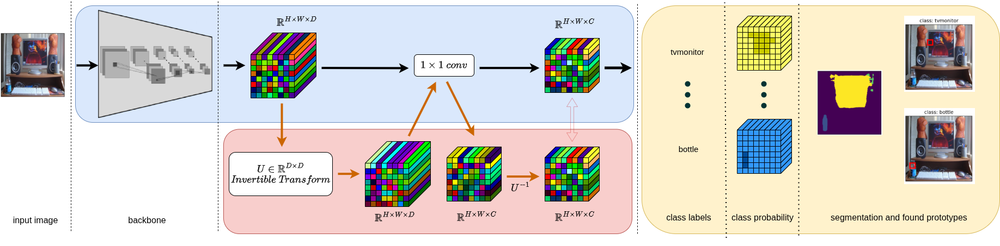

# PiPS: Post-Hoc Prototypical Explanations for Interpretable Semantic Segmentation

**Authors:** Miłosz Adamczyk, Tymoteusz Zapala, Piotr Borycki, Przemysław Spurek

## Abstract
With the increasing deployment of deep neural networks in critical systems, such as medical diagnostics and autonomous vehicles, ensuring their interpretability is crucial to building trust in decision-making systems. In the field of explainable artificial intelligence, prototype-based reasoning has gained particular popularity, as it mimics human cognitive processes by explaining model decisions based on visual similarity under the *looks like this* paradigm. While this paradigm has been thoroughly investigated in the context of global image classification, the interpretability of dense predictions, particularly semantic segmentation, remains largely unexplored despite its immense importance in tasks requiring precise object localization. Existing prototype-based interpretable segmentation models rely on ante-hoc architectures, which entails significant limitations because they require costly training from scratch and modifications to the network structure, ultimately leading to a noticeable drop in predictive performance compared to standard black-box models. To address this issue, we propose **PiPS (Post-hoc interpretable Prototypical Segmentation)**, the first fully post-hoc solution for generating prototypical explanations for semantic segmentation models. Our method enables the extraction of intuitive, spatially localized explanations from any pre-trained network without modification or fine-tuning, thereby preserving 100% of the model’s original predictive performance. This approach opens a new avenue for the safe and cost-effective deployment of transparent systems in advanced computer vision tasks.



## Installation

The following installation instructions are provided for a Conda-based Python environment.

### Clone the Repository
```bash
# SSH
git clone git@github.com:gmum/PiPS.git

# or HTTPS
git clone https://github.com/gmum/PiPS.git


cd PiPS
```

### Environment Setup
To install:

```bash
# Create and activate the environment
conda create -y -n pips-epic-env python=3.10
conda activate pips-epic-env

# Install PyTorch
# To install with CUDA (e.g., for local execution on an Acer Nitro or SLURM environments on Athena A100 nodes), uncomment ONE of the following:

# For CUDA 12.1:
# pip install torch torchvision --index-url https://download.pytorch.org/whl/cu121

# For CUDA 11.8:
# pip install torch torchvision --index-url https://download.pytorch.org/whl/cu118

# Otherwise, install CPU-only version:
pip install torch torchvision --index-url https://download.pytorch.org/whl/cpu

# Install other dependencies
pip install -r requirements.txt
```

## Dataset: PASCAL VOC 2012

The framework utilizes the PASCAL VOC 2012 dataset. The `VOCDatasetManager` relies on `torchvision.datasets.VOCSegmentation`, which will automatically download the dataset to the `data_path` configured in `config.py` (default: `./data`).

If you are configuring the dataset manually, the expected directory structure is:
```text
data/
└── VOCdevkit/
    └── VOC2012/
        ├── Annotations/
        ├── ImageSets/
        │   ├── Action/
        │   ├── Layout/
        │   ├── Main/
        │   └── Segmentation/
        ├── JPEGImages/            # Original RGB images
        ├── SegmentationClass/     # Semantic segmentation masks
        └── SegmentationObject/    # Instance segmentation masks
```

## Running the Code

The `config.py` file contains the configuration in which the model was trained and used to generate the results presented in the paper. 

At the very beginning of execution, depending on the `apply_epic` mode, the script assigns the `save_path` variable to either `epic_checkpoint.pth` or `deeplab_checkpoint.pth` (saved by default in the `./results` directory). Note that the `config.py` file requires setting `"apply_epic": True` for the prediction script to run correctly.

### 1. Training (`main.py`)
Executes the training sequence. 
*   If `"apply_epic": True`: Trains the EPIC disentanglement module.
*   If `"apply_epic": False`: Fine-tunes the baseline segmentation model.
```bash
python main.py
```

### 2. Prediction & Explanations (`predict.py`)
Generates explanations for the entire test dataset. It checks the `apply_epic` flag—if enabled (`True`), it loads the `epic_checkpoint.pth`. Otherwise, it falls back to the baseline `deeplab_checkpoint.pth`.

During execution, it saves the exemplar database (`exemplar_scores.pt`) into `results/epic_results/` for generating results, and outputs the visualized image explanations into corresponding subfolders based on the number of object classes found in the image.
```bash
python predict.py
```

**Generated Output Structure:**
```text
results/
└── epic_results/
    ├── exemplar_scores.pt
    ├── class 1/
    ├── class 2/
    └── ...
```

The directories class 1, class 2, etc., group the visual explanation results based on the number of unique object classes the model localized in a given image. For example, class 1 contains outputs for images where the model identified exactly 1 object class (excluding background), class 2 for images with 2 classes, and so on.
